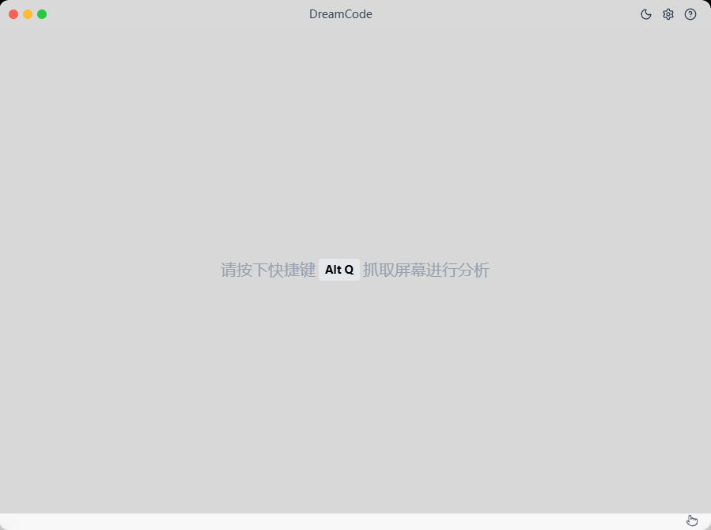
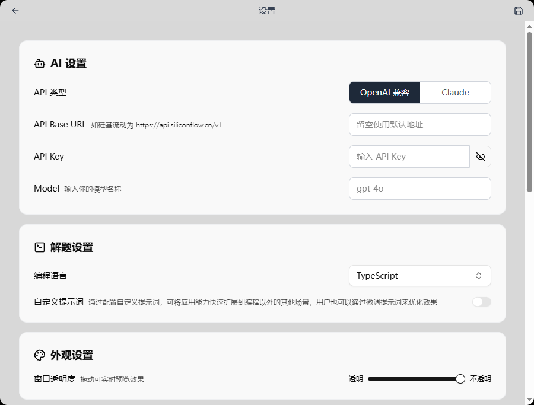
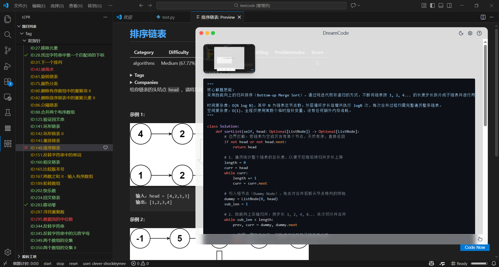

# DreamCode

AI 驱动的编码面试助手，支持实时截屏分析、隐身窗口、深色模式，适配国内 AI 生态。

> 本项目基于 [interview-coder-cn](https://github.com/ooboqoo/interview-coder-cn) 二次开发。

## 项目简介

DreamCode 是一个面向中文用户的编码面试辅助工具，通过快捷键截取屏幕内容发送给 AI 大模型进行分析，实时给出解题思路和代码。窗口具备隐身能力，在屏幕共享时不会被发现。

### 适用场景

- 编程面试：分析屏幕上的题目，实时给出解题思路和代码，即便面试官要求分享屏幕也不会被发现
- 笔试题目：不会导致笔试网页失焦，可规避"跳出网页"检测
- 其他场景（如英语机试等）：可通过"自定义提示词"功能自行扩展

### 使用界面

<p align="center">主页面</p>


<p align="center">设置页</p>


### 对话效果




## 项目改进之处

### 新增功能

- **多类型 API 兼容**：同时支持 OpenAI 兼容格式和 Claude (Anthropic) 原生 API，设置界面一键切换
- **深浅色切换**：标题栏提供太阳/月亮切换按钮，全局适配深色主题
- **UI 界面美化**：圆角窗口、macOS 风格交通灯按钮、毛玻璃效果
- **配置持久化与显式保存**：设置保存到本地配置文件，移除 `.env` 依赖；设置页面必须点击保存才生效

### 修复的 Bug

- **模型显示问题**：修复窗口自定义模型空白显示，去除硬编码模型列表，全部改为自定义输入
- **内容遮挡与快捷键不同步**：修复底部状态栏遮挡内容、快捷键提示未跟随用户自定义设置的问题


## 如何使用

### 直接下载安装包

前往 [Releases](https://github.com/dream-rec/dreamcode/releases) 页面下载：

| 文件 | 平台 | 说明 |
|------|------|------|
| `dreamcode-*-setup.exe` | Windows | 安装版，自动创建桌面快捷方式 |
| `dreamcode-*-portable.exe` | Windows | 便携版，免安装直接运行 |
| `dreamcode-*.dmg` | macOS | macOS 安装包 |

### 从源码构建

#### 1. 安装依赖

项目运行依赖 Node.js 环境，如未安装请先 [下载安装](https://nodejs.org/zh-cn/download)。

```bash
npm install
```

#### 2. 启动开发模式

```bash
npm run dev
```

### 配置 API

启动后在设置页面配置：

1. **API 类型**：选择 OpenAI 兼容 或 Claude
2. **API Base URL**：填写服务商地址（留空使用默认）
3. **API Key**：填写你的 API Key
4. **Model**：填写模型名称

支持的服务商：[硅基流动](https://cloud.siliconflow.cn/i/SG8C0772)、[OpenRouter](https://openrouter.ai/)、OpenAI 官方、Anthropic 官方等。


## 关于隐身能力

隐身功能适配市面上大部分会议软件（如腾讯会议等），但少部分软件和浏览器可能无法正常隐身。使用前请自行测试，本项目不承担任何责任。


## 技术栈

- Electron 37 + React 19 + TypeScript 5.8
- Vite 7 (via electron-vite 4)
- Tailwind CSS 4 + shadcn/ui
- Zustand 5 (状态管理)
- Vercel AI SDK (`ai` + `@ai-sdk/openai` + `@ai-sdk/anthropic`)


## 许可协议

本项目采用 **[CC BY-NC 4.0](https://creativecommons.org/licenses/by-nc/4.0/deed.zh)** 协议许可。

您可以自由使用、复制、修改本项目代码，但 **禁止任何形式的商业用途**。


## 致谢

- 原项目 [interview-coder-cn](https://github.com/ooboqoo/interview-coder-cn) by Gavin Wang
- 灵感来源 [Interview-Coder](https://github.com/ibttf/interview-coder)
