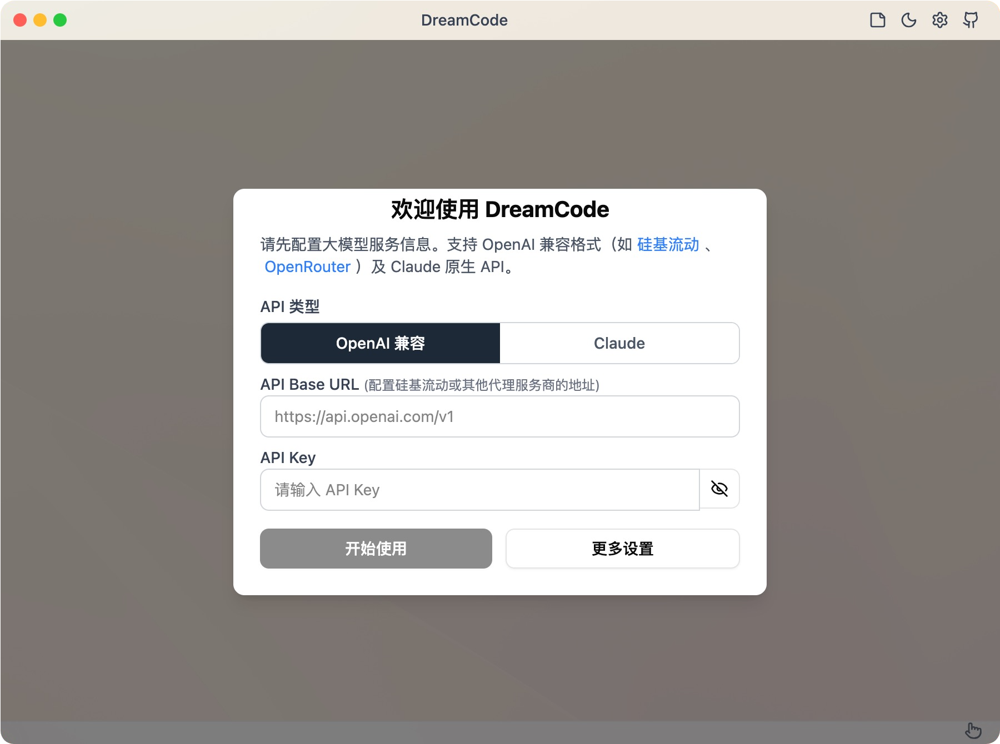
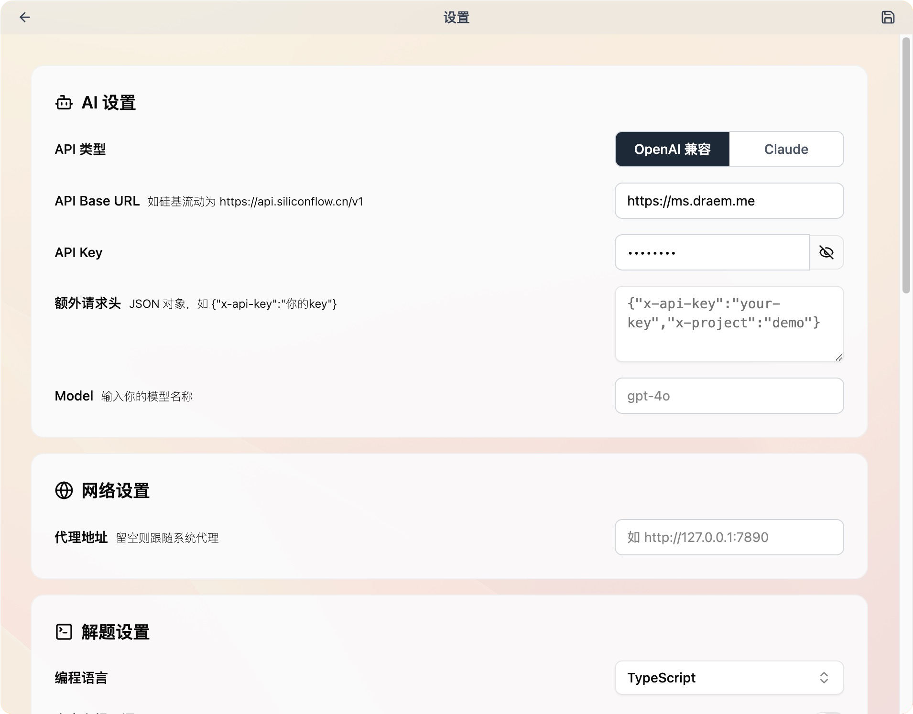
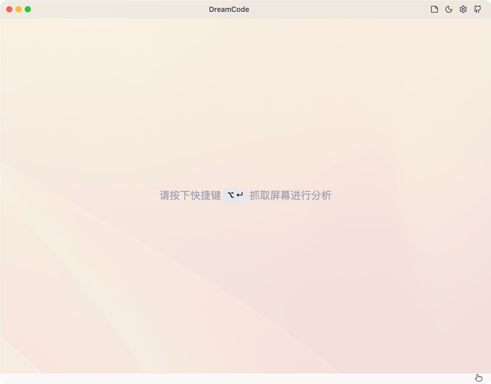
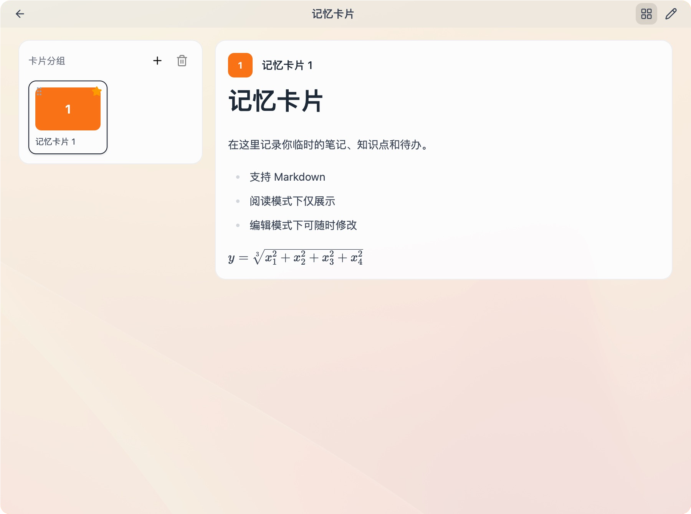
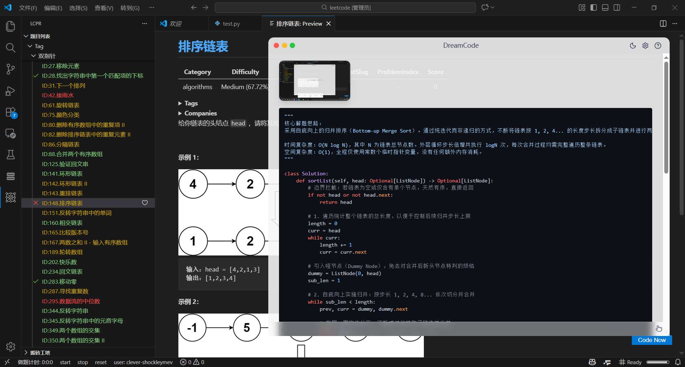

<p align="center">
  
</p>

<h1 align="center">DreamCode</h1>

<p align="center"><strong>AI coding-interview assistant — one-key screenshot, live solutions, invisible on screen share.</strong></p>

<p align="center">
  
  
  
  
  
</p>

<p align="center">中文版：<a href="README.md">README.md</a></p>

<p align="center">Built on <a href="https://github.com/ooboqoo/interview-coder-cn">interview-coder-cn</a></p>

---

## Why DreamCode

- **Invisible on screen share** — content protection is on, so the window stays out of recordings and shares in most meeting apps
- **Never steals focus** — screenshots and actions run through global shortcuts; the test page keeps focus and "left the page" checks stay quiet
- **Two API protocols** — OpenAI-compatible and Claude (Anthropic) native, switched from the settings page
- **Any model** — no hardcoded model list; type whatever name your provider serves
- **Memory cards** — keep prompts, templates, and stock answers ready (Markdown / LaTeX supported) and pull them up with a shortcut
- **Fully local** — API key and config stay in a local config file; no `.env` dependency, nothing uploaded

---

## Gallery

| Welcome | Settings |
| --- | --- |
|  |  |

| Chat window | Memory cards |
| --- | --- |
|  |  |

### Example



---

## Desktop downloads

Prefer not to set up Node? Grab a build from [Releases](https://github.com/dream-rec/dreamcode/releases).

| File | Platform |
| --- | --- |
| `dreamcode-*-setup.exe` | Windows installer (creates a desktop shortcut) |
| `dreamcode-*-portable.exe` | Windows portable (no install) |
| `dreamcode-*-x64-mac.dmg` | macOS Intel |
| `dreamcode-*-arm64-mac.dmg` | macOS Apple Silicon |

### First launch

The bundles are **not code-signed**, so the OS will block them once:

- **macOS**: the dialog reports an unverified developer. Right-click the app → Open → Open again. One time only.
- **Windows**: SmartScreen shows "Windows protected your PC". Click "More info" → "Run anyway".

On macOS you also need to grant DreamCode access under System Settings → Privacy & Security → Screen Recording, otherwise screenshots come back empty.

---

## Run locally

Needs Node.js. [Install it](https://nodejs.org/en/download) first if you haven't.

```bash
npm install
npm run dev
```

Package:

```bash
npm run build:mac    # or build:win / build:linux
```

---

## Usage

1. **Settings** — API type / Base URL / API key / model, pick the solution language, add a proxy if needed, then save (nothing applies until you save)
2. **Screenshot** — capture the question with a shortcut; stack several if the problem spans screens
3. **Solve** — send to the model with a shortcut; approach and code stream back
4. **Memory cards** — store prompts and templates, recall them with a shortcut

Works with [SiliconFlow](https://cloud.siliconflow.cn/i/SG8C0772), [OpenRouter](https://openrouter.ai/), OpenAI, Anthropic, and any OpenAI-compatible gateway.

Every shortcut is remappable in settings, and the status-bar hints follow your bindings.

---

## Where it fits

- **Coding interviews** — read the question off the screen and get approach plus code, unseen even while you share your screen
- **Online assessments** — the page never loses focus, so tab-out detection stays quiet
- **Anything else** — extend it through the custom prompt, e.g. language tests or Q&A drills

> Stealth works with most meeting software, but a few apps and browsers defeat it. Test it yourself first; this project takes no responsibility.

---

## License

Licensed under **[CC BY-NC 4.0](https://creativecommons.org/licenses/by-nc/4.0/)**.

Use, copy, and modify the code freely, but **commercial use of any kind is prohibited**.

---

## Star History

<a href="https://www.star-history.com/?repos=dream-rec%2Fdreamcode&type=date&legend=top-left">
 <picture>
   <source media="(prefers-color-scheme: dark)" srcset="https://api.star-history.com/chart?repos=dream-rec/dreamcode&type=date&theme=dark&legend=top-left&sealed_token=YJw9cNUHnLQqSWH8e0Z3SE-BFTz9wnvzrl1mf-0c4j_jJ2JKIm7op7lQ8lfLXRbU0-zNIlvewtq4UyzJSaFcR_VummenUQlpXYSWTnGdhfq2xbXutfpBdg" />
   <source media="(prefers-color-scheme: light)" srcset="https://api.star-history.com/chart?repos=dream-rec/dreamcode&type=date&legend=top-left&sealed_token=YJw9cNUHnLQqSWH8e0Z3SE-BFTz9wnvzrl1mf-0c4j_jJ2JKIm7op7lQ8lfLXRbU0-zNIlvewtq4UyzJSaFcR_VummenUQlpXYSWTnGdhfq2xbXutfpBdg" />
   
 </picture>
</a>

---

## Credits

- Upstream project [interview-coder-cn](https://github.com/ooboqoo/interview-coder-cn) by Gavin Wang
- Inspired by [Interview-Coder](https://github.com/ibttf/interview-coder)
